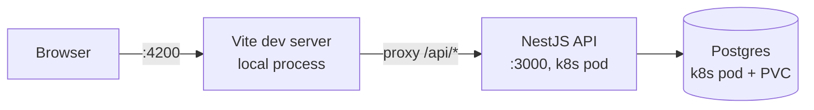
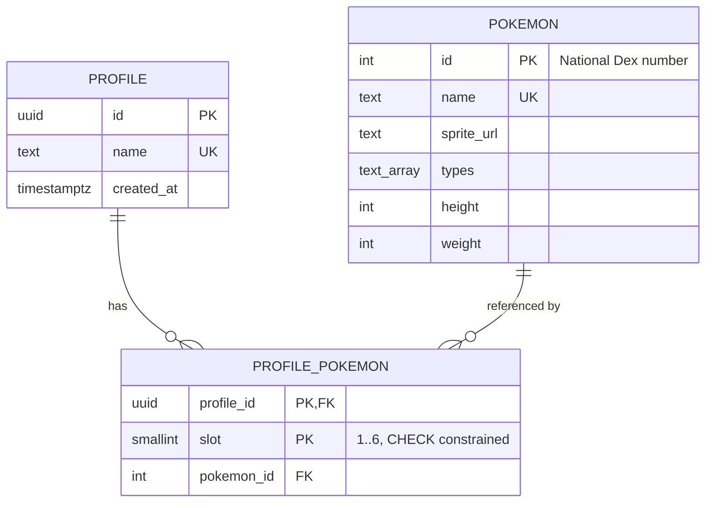
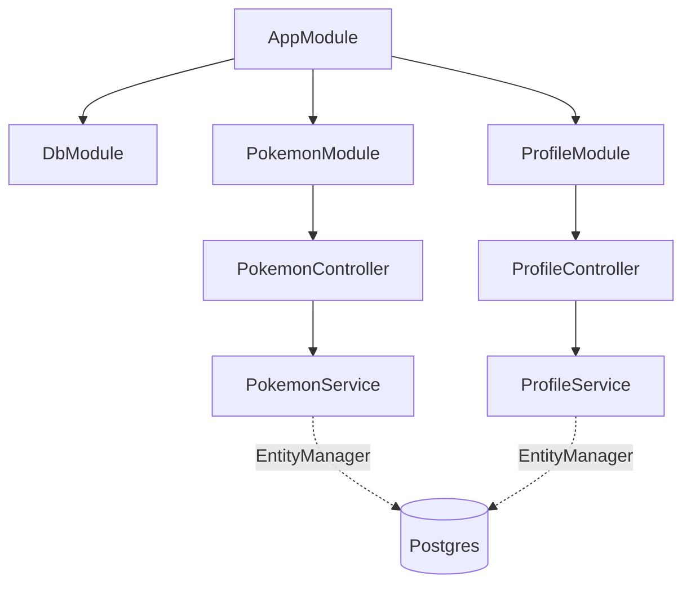
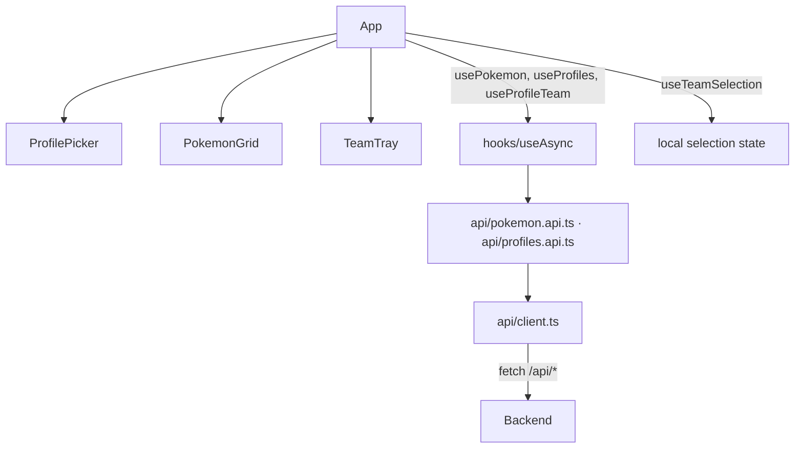
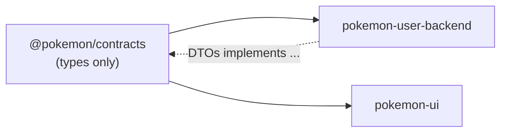

# Architecture

Technical reference for the system as built. For *why* things are built this way, see
[`DECISIONS.md`](DECISIONS.md). For the original plan and full contract spec, see
[`PLAN.md`](PLAN.md).

## System



Tilt runs all three. Frontend is a local process (fast HMR); backend and Postgres run in
Docker Desktop's Kubernetes. See `CLAUDE.md` for the dev-loop gotchas (manual backend build
trigger, PVC persistence).

CI (`.github/workflows/ci.yml`) runs `nx run-many -t lint test build` on every PR into `main`.

## Data model



`PROFILE_POKEMON` has a composite primary key `(profile_id, slot)`, no surrogate id, plus:

```sql
CHECK (slot BETWEEN 1 AND 6)              -- 6 legal slots per profile
UNIQUE (profile_id, pokemon_id)           -- no duplicate Pokémon on one team
```

Why this shape: `DECISIONS.md`.

## Request flow

`PUT /api/profiles/:id/team` end to end, one transaction:

1. Vite proxy forwards to `ProfileController`
2. `ValidationPipe` checks uuid + body shape → `VALIDATION_FAILED` if either fails
3. `ProfileService.setTeam`:
   1. `findProfileOrThrow` — `PROFILE_NOT_FOUND` if missing
   2. `validateTeamSelection` — size, duplicates, unknown ids
   3. `replaceTeam` — delete + recreate `ProfilePokemon` rows
   4. `loadTeam` — reload and return `ProfileWithTeamDto`

Every thrown `AppException` — from the pipe or the service — is caught by one global
`ApiErrorFilter` and turned into the same `ApiErrorBody` shape. Error precedence table:
`PLAN.md`.

## Module structure



`DbModule` registers every entity once (`autoLoadEntities` + the `entities` barrel).
`PokemonModule`/`ProfileModule` have no `MikroOrmModule.forFeature()` — adding it
double-registers the same entities and crashes on boot. Neither uses `@InjectRepository()`
anyway, so it wasn't doing anything.

## Frontend structure



Every data hook composes `useAsync` (`data`/`error`/`loading`/`refetch`). `refetch` isn't
awaitable — why: `DECISIONS.md`.

Submitting a team, client side:

1. `PokemonGrid` / `TeamTray` call `useTeamSelection.toggle` — local state only, no request
2. "Submit team" → `setTeam(profileId, { pokemonIds })`
3. Response (`ProfileWithTeamDto`) is written directly into local state
4. `ApiError` → message shown inline near the tray

## Contracts boundary



`pokemon-contracts` exports interfaces, the error envelope, and one runtime value
(`MAX_TEAM_SIZE`) — nothing else crosses the boundary. Backend DTOs `implements` the shared
request interfaces. MikroORM entities never serialize straight to the wire — mappers
(`*.mapper.ts` per module) sit at the boundary instead.

## API surface

Full endpoint table, request/response shapes, and error codes: `PLAN.md`.
